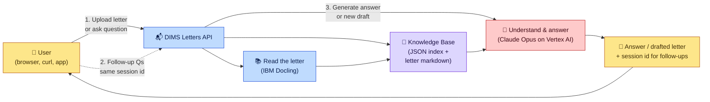
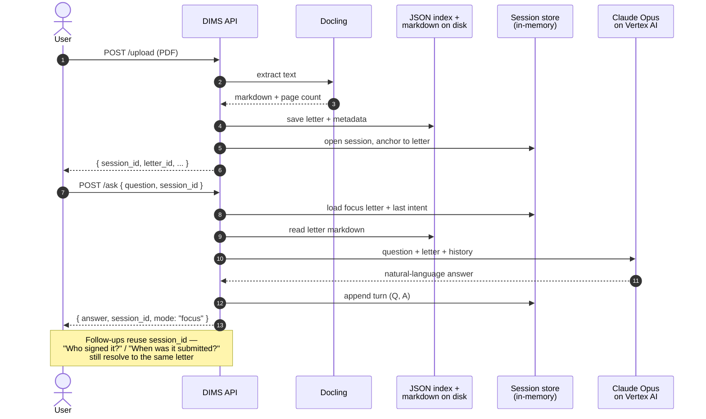
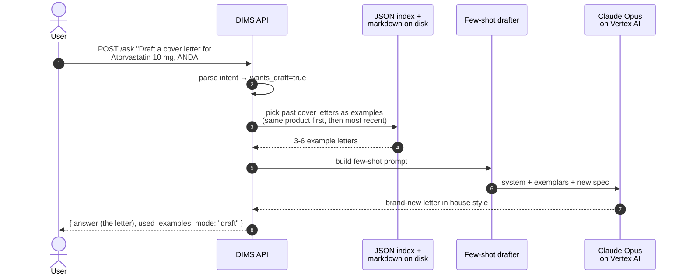
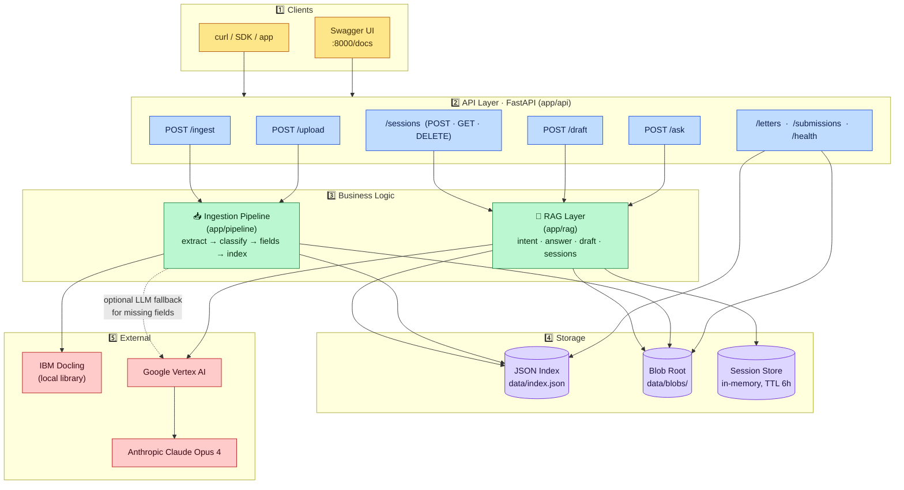

# DIMS Letters API — Architecture

A layered walkthrough of the system, scaling from a 30-second overview for non-technical readers down to a component-level view for engineers. Every Mermaid block below renders as an image directly on GitHub.

---

## 1. The 30-second summary

> **DIMS Letters API** lets a user **upload an FDA letter (PDF / DOCX) and chat with it in plain English** — or ask the system to **draft a new letter** in Dr. Reddy's house style based on past letters. It runs on FastAPI, uses **IBM Docling** to read PDFs, and **Anthropic Claude Opus on Google Vertex AI** to understand and write text. No database — just a JSON index file plus the extracted markdown on disk.

**Read it like a story:**

1. User uploads a letter or asks a question.
2. The API reads the PDF (Docling) and stores the text in a small knowledge base.
3. Claude Opus answers the question — or drafts a brand-new letter — using past letters as examples.
4. The user gets the answer and can keep asking follow-ups via a session id.

---

## 2. Two user journeys (step-by-step)

### Journey A — *"I have a letter. Let me ask questions about it."*

### Journey B — *"I don't have the letter yet — draft one for me."*

---

## 3. Technical architecture (for engineers)

Five clear layers, top to bottom. Each box has only its role; the table after the diagram maps boxes to actual files.

### File map (what lives where)

| Layer | Component | Code location | One-line role |
|---|---|---|---|
| API | Routes | `app/api/routes.py` | All HTTP endpoints |
| API | Schemas | `app/api/schemas.py` | Request / response Pydantic models |
| API | App entry | `app/main.py` | FastAPI app; OpenAPI 3.0 downgrade so Swagger renders the upload picker |
| Pipeline | Adapters | `app/adapters/` | Pluggable inputs (file-store, RDB stub) |
| Pipeline | Orchestrator | `app/pipeline/ingest.py` | Folder ingest + direct upload |
| Pipeline | Extract | `app/pipeline/extract.py` | Docling PDF → markdown + page map |
| Pipeline | Fields | `app/pipeline/fields.py` | Classify letter kind, pull header fields (regex + LLM fallback) |
| RAG | Intent parser | `app/rag/intent.py` | Question → `{product, kind, anda, seq, wants_draft}` |
| RAG | Answer | `app/rag/answer.py` | Lookup / focus / disambiguate / draft fall-through |
| RAG | Drafter | `app/rag/draft.py` | Few-shot prompt build, exemplar selection |
| RAG | Sessions | `app/rag/sessions.py` | Multi-turn memory (focus letter, intent carry-over, history) |
| Storage | Index | `app/index.py` → `data/index.json` | All submission + letter records |
| Storage | Blobs | `data/blobs/originals/`, `data/blobs/markdown/` | Original files + Docling output |
| LLM | Vertex client | `app/llm.py` | `AnthropicVertex` (Claude Opus 4 on Vertex) |
| Config | Settings | `app/config.py` + `.env` | All env-driven knobs |

---

## 4. The modes `/ask` can return (cheat sheet)

| `mode` | When | What you get back |
|---|---|---|
| `lookup` | Question matched exactly one indexed letter | Claude's summary + the matched letter |
| `focus` | Same session asked a follow-up about its anchored letter | Answer against the focused letter |
| `disambiguate` | Multiple letters match (e.g. *"everything for Voclosporin"*) | List of candidates; ask the user to narrow down |
| `draft` | User said "draft" / no letter exists for that product | A newly drafted letter in house style |
| `not_found` | Not enough info to look up *or* draft | Friendly error explaining what's missing |

---

## 5. Configuration knobs

All driven by environment variables (or a `.env` file at repo root):

| Variable | Purpose |
|---|---|
| `SOURCES__FILESTORE__ROOT` | Folder root for batch ingest (`POST /ingest`) |
| `BLOB_ROOT` | Where Docling output + originals are persisted (default `data/blobs`) |
| `INDEX_PATH` | Path to the JSON index (default `data/index.json`) |
| `VERTEX_PROJECT_ID` | GCP project hosting Vertex AI |
| `VERTEX_REGION` | Vertex region (default `us-east5`) |
| `ANTHROPIC_MODEL` | Claude model id (default `claude-opus-4@20250514`) |
| `ANTHROPIC_MAX_TOKENS` | Per-call cap (default 4096) |
| `GOOGLE_APPLICATION_CREDENTIALS` | Path to GCP service-account JSON (ADC) |
| `LOG_LEVEL` | Python logging level (default `INFO`) |

If `VERTEX_PROJECT_ID` is unset, the API still works for ingest, upload, listing, and verbatim letter retrieval — only the LLM-powered answers and drafts degrade gracefully with a clear "LLM not configured" message.
